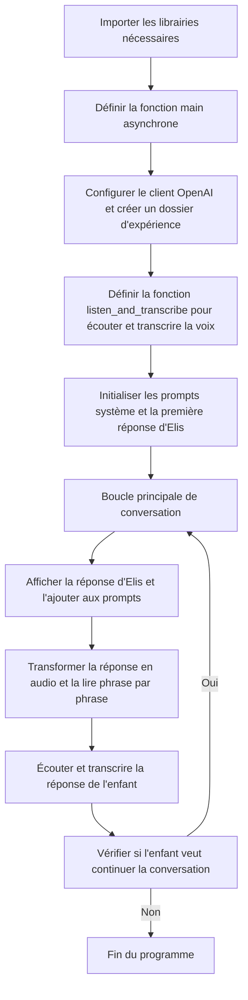
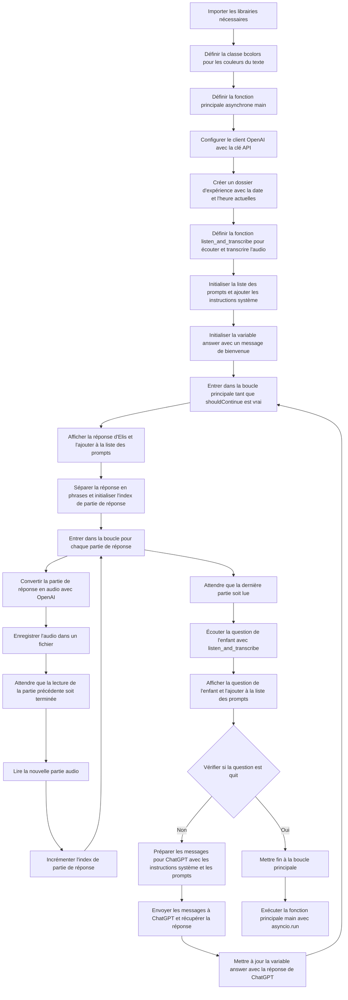

# ProjetElis
Projet pour le ExpoScience de @BelangerVincent et Attis.

Pour le moment, vous pouvez consulter [notre documentation papier scané en PDF](docs/2023-11-21%20-%20Projet%20Mon%20ami%20Élis%20(Elis%2C%20ELI5)%20-%20Vincent%20Exposcience%20CSB.pdf) en attendant une meilleure documentation ici ;)


# Pour installer
```
git clone https://github.com/PatBQc/ProjetElis
cd ProjetElis
pip install openai
pip install playsound==1.2.2
pip install SpeechRecognition
sudo apt install python3-gst-1.0
sudo apt-get install portaudio19-dev python3-pyaudio
pip install PyAudio
sudo apt-get install flac

mkdir experiments

sudo apt-get install pulseaudio pavucontrol
pavucontrol

python start.py
```

# Résumé du code source 

## Description générale

Ce code est un script Python qui permet d'avoir une conversation interactive avec un agent conversationnel nommé "Elis". L'agent est basé sur le modèle de langage GPT-4 d'OpenAI et est configuré pour répondre de manière appropriée et engageante à un enfant de 5 ans.

## Fonctionnalités principales

1. **Reconnaissance vocale**: Le script utilise la bibliothèque `speech_recognition` pour écouter l'entrée vocale de l'utilisateur via le microphone. L'audio est enregistré et transcrit en texte.

2. **Synthèse vocale**: Les réponses générées par l'agent conversationnel sont converties en audio en utilisant l'API de synthèse vocale d'OpenAI. Les fichiers audio sont enregistrés et lus à l'aide de la bibliothèque `playsound`.

3. **Interaction avec GPT-4**: Le script utilise l'API d'OpenAI pour envoyer les messages de l'utilisateur au modèle GPT-4 et recevoir les réponses générées. Les messages sont structurés sous forme de "prompts" avec des rôles tels que "system", "assistant" et "user".

4. **Personnalisation de l'agent**: L'agent conversationnel est personnalisé avec des instructions spécifiques, telles que son nom, sa forme, son public cible et les consignes sur le style et le contenu de ses réponses.

5. **Gestion des conversations**: Le script gère le flux de conversation en alternant entre les entrées de l'utilisateur et les réponses de l'agent. Les messages sont stockés dans une liste de "prompts" pour maintenir le contexte de la conversation.

## Structure du code

- Les bibliothèques nécessaires sont importées au début du script.
- La classe `bcolors` est définie pour permettre la coloration du texte dans le terminal.
- La fonction principale `main()` est définie comme une fonction asynchrone.
- La fonction `listen_and_transcribe()` est responsable de l'écoute du microphone et de la transcription de l'audio en texte.
- La boucle principale de conversation se trouve dans la fonction `main()`, où les messages sont échangés entre l'utilisateur et l'agent jusqu'à ce que l'utilisateur décide de quitter.
- Les réponses de l'agent sont divisées en phrases et lues de manière asynchrone pour améliorer l'expérience utilisateur.
- Les entrées de l'utilisateur sont obtenues soit via le clavier, soit via la reconnaissance vocale.
- Les messages sont envoyés à l'API d'OpenAI pour générer les réponses de l'agent.
- Le script s'exécute en appelant la fonction `main()` à l'aide de `asyncio.run()`.

Ce script démontre l'utilisation de diverses bibliothèques Python et de l'API d'OpenAI pour créer un agent conversationnel interactif capable de communiquer par voix avec un enfant de 5 ans.

## Librairies utilisées
- `os`: pour la gestion des fichiers et répertoires
- `openai`: pour l'utilisation de l'API d'OpenAI
- `playsound`: pour jouer des fichiers audio
- `datetime`: pour la gestion des dates et heures
- `speech_recognition`: pour la reconnaissance vocale
- `re`: pour les expressions régulières
- `asyncio`: pour la programmation asynchrone

## Classe `bcolors`
Cette classe permet de changer les couleurs du texte dans le terminal.

## Fonction `main()`
C'est la fonction principale du programme, elle est asynchrone.

### Initialisation
- Connexion à l'API d'OpenAI avec une clé secrète
- Création d'un répertoire pour stocker les fichiers de l'expérience

### Fonction `listen_and_transcribe()`
Cette fonction permet d'écouter le micro et de transcrire la parole en texte jusqu'à ce que le mot clé "STOP" soit prononcé.

### Boucle principale
- Initialisation de la liste des messages échangés (`prompts`)
- Définition de la personnalité d'Elis dans les messages système
- Boucle de discussion jusqu'à ce que l'utilisateur dise "quit"
  - Affichage de la réponse d'Elis
  - Découpage de la réponse en phrases
  - Synthèse vocale de chaque phrase avec l'API d'OpenAI
  - Écoute de la question de l'enfant (via le micro ou le clavier)
  - Ajout de la question à la liste des messages
  - Envoi de tous les messages à l'API d'OpenAI pour obtenir la réponse suivante
  - Stockage de la réponse dans la variable `answer` pour la prochaine itération

## Lancement du programme
La dernière ligne de code lance la fonction `main()` de manière asynchrone.

# Un diagramme pour s'y retrouver
## Simplement...
De manière très simple, l'algorithme général ressemble à ceci:


## ...et de manière plus complète
Ce diagramme résume le flux du code, en commençant par l'importation des librairies nécessaires, puis en définissant la fonction principale `main()` et la fonction `listen_and_transcribe()`. La boucle principale alterne entre l'affichage de la réponse d'Elis, la conversion en audio, la lecture de l'audio, l'écoute de la question de l'enfant, et l'envoi des messages à ChatGPT pour obtenir une réponse. Le processus se répète jusqu'à ce que l'enfant dise "quit".

